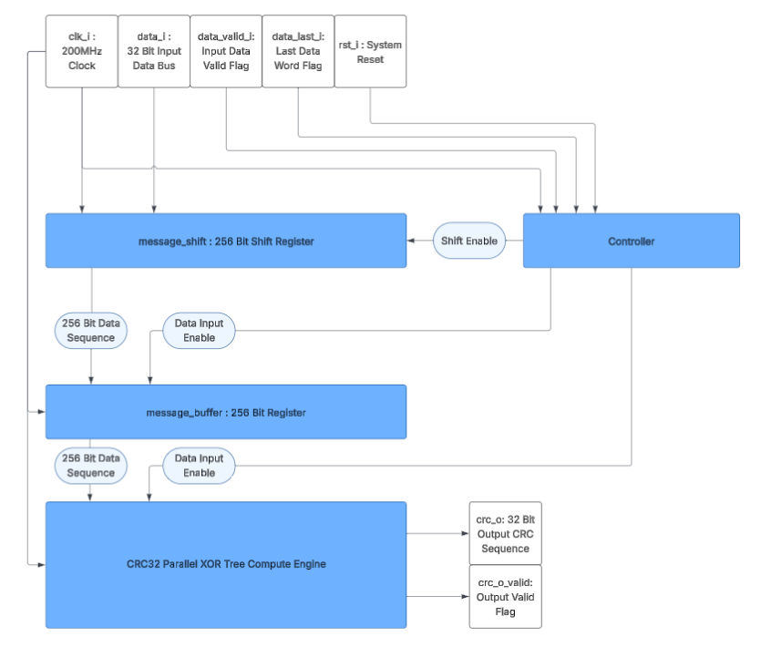
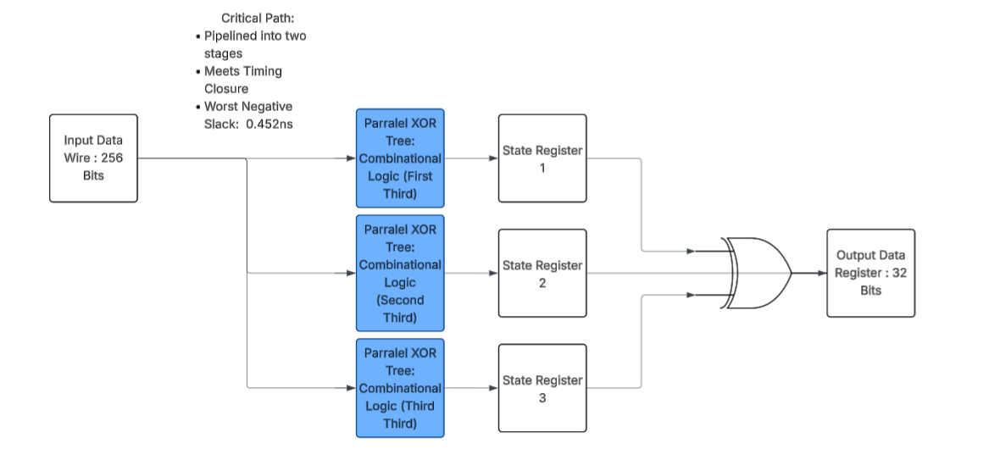

# Low Latency 256 Bit CRC-32 Engine for High Speed Applications

This project is a pipelined CRC-32 computation engine designed for 200MHz operation on Xilinx Artix-7 FPGAs. Optimized for low latency packet processing applications such as high-speed networking.

**Target:** Basys3 (Artix-7 xc7a35tcpg236-1)
**Achieved Frequency:** 219.9 MHz
**Latency:** 2 Clock Cycles
**Throughput:** 1 CRC per 2 Cycles

## Performance Metrics

| Metric | Value |
|--------|-------|
| Target Frequency | 200MHz |
| Achieved Frequency | 207MHz |
| Worst Negative Slack | +0.452na (@200MHz) |
| Pipeline Stages | 2 |
| Computation Latency | 2 Cycles (10ns @ 200MHz) |
| Input Data Width | 256 Bits |
| Output CRC Width | 32 Bits |
| Resource Utilization | 953 LUTs, 730 FFs |

**Device:** Xilinx Artix-7 (xc7a35tcpg236-1)
**Tool:** Vivado 2023.2

## Architecture

This repository contains two source code files. These are

* Top\_level.v
* lfsr\_crc.v

Top\_level.v serves as an example of how the CRC32 engine can be applied in a larger design. In this case, the Top\_level.v file implements a case where a 32 bit data bus is input into a 256 bit shift register and upon the full message arriving, the 256 received bits are processed through the crc32 computation engine lfsr\_crc.v. The crc result is outputted for analysis and verification.


lfsr\_crc.v is an adapted version of [Alex Forenchich's lfsr.v design](https://github.com/alexforencich/verilog-lfsr/blob/master/rtl/lfsr.v). The original lfsr.v is a parametrized implementation of a parallel xor tree lfsr simulator. This is used to implement the CRC32 logic calculation. The original lfsr.v is purely combinational logic and can be customized for any number of input data bits, initial state bits, polynomial bits, and other characteristics.

The block diagram below shows the architecture of Top\_level.v 


The block diagram below shows the architecture of the modified lfsr.v module. 



## Design Evolution

For the sake of learning value and exploration, the original design of lfsr.v was synthesized and implemented in Vivado to assess for timing closure. At 256 data bits, the original design would fail to meet timing closure at 200MHz with a worst negative slack(WNS) of 5.3ns. The image below depicts the critical path of this architecture. 


In order to modify this design for timing closure, the first instinct is to pipeline the XOR tree combinational logic. Given that a 200MHz clock frequency would imply a 5ns clock period, it became clear that simply splitting the combinational logic into two sequential stages would not suffice. The mathematics behind this judgement are as follows

* 5ns clock period
* 5.3 WNS implies that the logic takes 10.3ns to reach the output register
* Pipelining the logic into two seconds would result in a 5.15ns delay or 0.15 WNS at best. This is also without accounting for setup and hold time.

Given the above judgement, the first solution to come to mind was to use three sequential pipeline stages, however, it became apparent that the design could pass timing closure in two pipeline stages with the following architecture

* In stage 1, split the xor tree into three thirds and process them in parallel
* In stage 2, xor the results of the three parallel thirds of the xor trees together to yield the output result.

With this architecture, the design would be able to pass timing closure while yielding an output in only two clock cycles instead of three.

## File Structure
The file structure of the repository is as follows
```
/
├── sources_1/new
│   ├── Top_Level.v             # Top-level wrapper with buffering
│   └── lfsr_crc.v                  # LFSR-based parallel CRC implementation
├── constrs_1/new
│   └── timing.xdc              # Timing constraints for Basys3
├── sim_1/new
│   ├── Top_Level_tb.sv		 # Simulation Testbench
├── docs/
│   ├── timing_report.txt        # Post-implementation timing report
│   ├── CRC32TopLevelDiagram.png # Top Level Block Diagram
│   ├── OldArchitecture.png	  # Old Block Diagram
│   └── NewArchitecture.png      # New Block diagram
└── README.md
```

## References and Acknowledgements
1. LFSR implementation adapted from [Alex Forencich's verilog-ethernet](https://github.com/alexforencich/verilog-ethernet)
2. CRC-32 polynomial specification: IEEE 802.3 (Ethernet)
3. "A Painless Guide to CRC Error Detection Algorithms" - Ross Williams

This project was developed as a learning exercise in:
- FPGA timing closure techniques
- Pipeline architecture design
- High-speed digital design for HFT applications

Special thanks to the open-source FPGA community for reference implementations.
